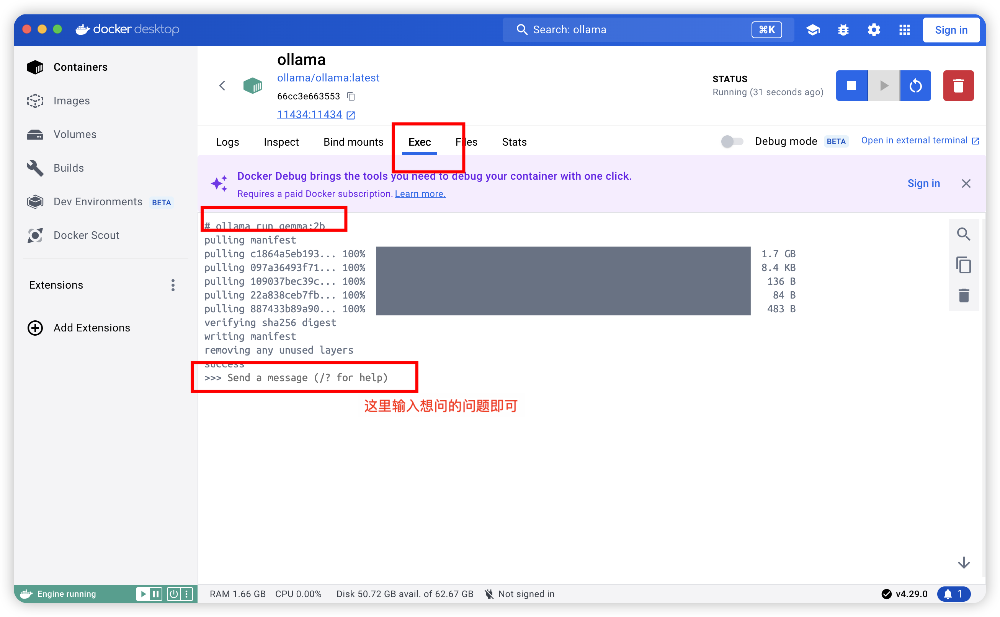
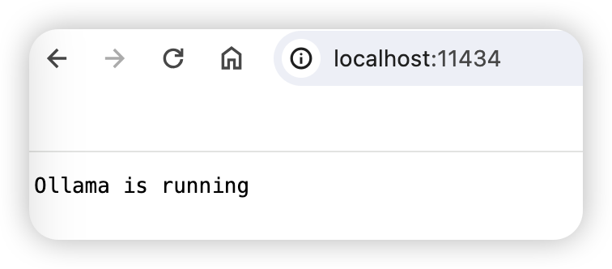
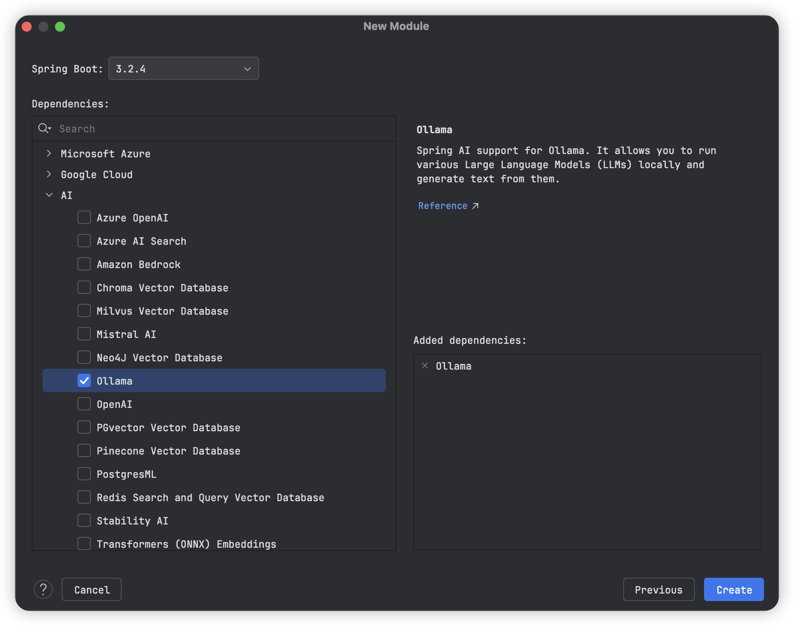
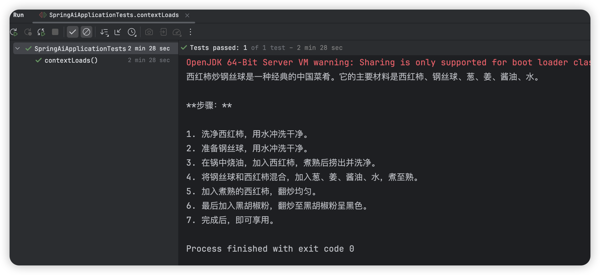
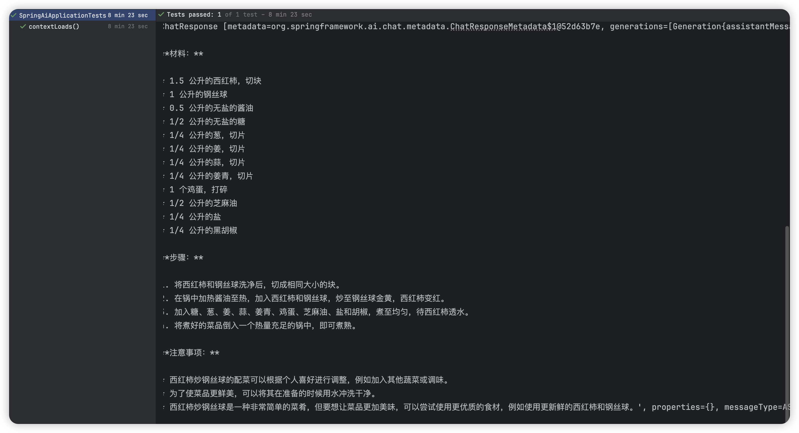
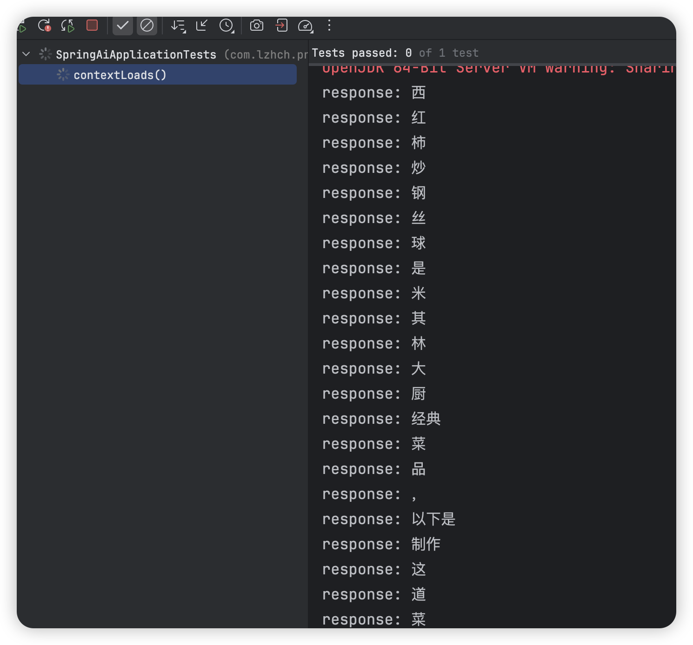

## SpringAI-Java生态接入LLM(Ollama)


#### 前言

最近，Spring官网发布了SpringAI，可点此查看https://spring.io/blog/2024/03/12/spring-ai-0-8-1-released，对于SpringAI的介绍，可看官方文档：https://spring.io/projects/spring-ai#overview。

本文将使用SpringAI配合Ollama完成SpringAI的体验，下面分别介绍SpringAI和Ollama。

#### 一、Spring AI

Spring AI是一个专为人工智能工程而设计的应用框架。它的目标是将Spring生态系统的设计原则，如可移植性和模块化设计，应用于人工智能领域，并推广使用纯Java对象（POJO）作为AI领域应用程序的构建块。

##### 1.Spring AI的核心特性

- 跨AI提供商的API支持：Spring AI提供了一套可移植的API，支持与多个AI服务提供商的聊天、文本到图像和嵌入模型进行交云。
- 同步和流式API选项：框架支持同步和流式API，为开发者提供了灵活的交互方式。
- 模型特定功能访问：允许开发者通过配置参数访问特定模型的功能，提供了更细致的控制。

##### 2.支持的模型

>  地址：https://ollama.com/library

- 聊天模型：包括OpenAI、Azure Open AI、Amazon Bedrock、Cohere's Command、AI21 Labs' Jurassic-2、Meta's LLama 2、Amazon's Titan、Google Vertex AI Palm、Google Gemini、HuggingFace（包括Meta的Llama2等数千种模型）、Ollama（本地运行AI模型）、MistralAI等。
- 文本到图像模型：如OpenAI的DALL-E、StabilityAI等。
- 嵌入模型：包括OpenAI、Azure Open AI、Ollama、ONNX、PostgresML、Bedrock Cohere、Bedrock Titan、Google VertexAI、Mistal AI等。

##### 3.向量存储API和向量数据库

Spring AI提供了跨不同提供商的向量存储API，具有类似SQL的元数据过滤API，保持了可移植性。支持的向量数据库包括Azure Vector Search、Chroma、Milvus、Neo4j、PostgreSQL/PGVector、PineCone、Redis、Weaviate、Qdrant等。

##### 4.函数调用和ETL框架

Spring AI允许开发者声明`java.util.Function`实现，用于OpenAI模型的提示响应中。这一特性最小化了不必要的代码，并使AI模型能够请求更多信息以完成其响应。此外，框架还包括一个基于Java函数编程概念的ETL框架，帮助开发者将文档传输到模型提供商使用的向量存储中。

##### 5.丰富的参考文档和示例应用

Spring AI配备了详尽的参考文档、示例应用程序和研讨会/课程材料，确保开发者拥有开始使用和充分利用框架所需的所有资源。

##### 6.Spring AI的未来

Spring AI的未来版本将在当前基础上构建，计划提供对更多AI模型的访问，例如Google刚刚发布的Gemini多模态模型。框架还将引入评估AI应用程序效果的工具，更多的便利API和功能，以帮助解决查询/总结文档等常见用例。

##### 7.Spring AI的使用

要开始使用Spring AI，只需几个简单的步骤：

1. 安装Spring CLI。
2. 在shell中运行以下命令创建一个新应用程序：
   1. ```Plain
      spring boot new --from ai --name myai
      ```
3. 这将创建一个用于与ChatGPT进行基本交互的应用程序。按照生成的README文件中的说明获取您的API密钥。
4. 使用以下命令运行应用程序：
   1. ```Plain
      ./mvw spring-boot:run
      ```
5. 使用curl测试端点：
   1. ```Plain
      curl localhost:8080/ai/simple
      ```

---

---

#### 二、Ollama：本地运行大型语言模型的轻量级框架

Ollama是一个开源项目，旨在为用户提供一个简单、可扩展的框架，以便在本地机器上快速启动和运行大型语言模型。无论是研究人员、开发者还是对人工智能感兴趣的爱好者，Ollama都提供了一个便捷的途径来探索和利用最新的语言模型技术。

##### 1.核心特性

- 多平台支持：Ollama支持macOS、Windows预览版和Linux操作系统，确保了广泛的用户基础能够使用该框架。
- Docker**镜像：通过官方的Docker镜像`ollama/ollama`，用户可以轻松地在容器化环境中部署Ollama。
- 丰富的模型库：项目支持包括Llama 2、Mistral、Gemma在内的多种大型语言模型，用户可以根据需要选择合适的模型。
- 易于安装：Ollama提供了详细的安装指南，无论是通过下载压缩包还是使用命令行工具，用户都能轻松完成安装过程。
- 模型自定义：用户可以通过创建Modelfile来导入GGUF模型，或者从PyTorch和Safetensors导入模型，实现模型的个性化定制。
- 命令行界面（CLI）：Ollama提供了一系列的CLI命令，简化了模型的创建、管理和运行过程。
- REST API：通过REST API，用户可以编程方式运行和管理模型，为自动化和集成提供了便利。
- 社区集成：Ollama与多个社区项目集成，包括Web和桌面应用程序、终端工具、数据库、包管理器和移动应用等，扩展了其应用范围。

##### 2.模型安装和使用

Ollama官网：https://ollama.com/

Ollama Github地址：https://github.com/ollama/ollama

###### 2.1 macOS安装指南

1. 去官往下载并根据相关提示安装

1. 打开终端，切换到解压后的Ollama目录，运行Ollama的启动命令。

   ```Plain
   cd Ollama-darwin
   ./ollama
   ```

###### 2.2 Windows安装指南

1. 去官网下载`OllamaSetup.exe`文件，并按照安装向导的指示完成安装。

1. 安装完成后，可以通过运行Ollama的命令或启动桌面应用程序来验证安装是否成功。

###### 2.3 Linux安装指南

1. 通过curl安装：

1. 打开终端，运行以下命令来安装Ollama。

   ```Bash
   curl -fsSL https://ollama.com/install.sh | sh
   ```

1. 如果希望手动安装或需要更详细的安装步骤，可以参考Ollama的GitHub仓库中的Linux安装文档。

   > https://github.com/jmorganca/ollama/blob/main/docs/linux.md
   
1. 运行Ollama，可以通过终端运行Ollama的命令来启动框架。

###### 2.4 Docker安装指南

1. 拉取Ollama Docker镜像

   ```Bash
   docker pull ollama/ollama
   ```

1. 运行Docker容器

   ```Bash
   docker run -it ollama/ollama
   ```


###### 2.5 验证安装

无论使用的是哪种安装方法，都可以通过运行以下命令来验证Ollama是否已成功安装并运行：

```Plain
ollama run gemma:2b
```

这将启动Gemma:2b模型（中文相对友好），首次运行会下载模型，较慢，成功安装如下图：



也可以通过访问 `http://localhost:11434` 来查看是否运行成功



---

---

#### 三、SpringAI 集成 Ollama

##### 1. 创建Spring项目

可以使用idea 的 初始化项目，也可以手动添加相关依赖。

spring 初始化，勾选Ollama，其余依赖按需添加。



pom 文件，注释使用 spring 的仓库，因为 spring 没有把 AI 的依赖放到公共仓库中。

~~~xml
<?xml version="1.0" encoding="UTF-8"?>
<project xmlns="http://maven.apache.org/POM/4.0.0" xmlns:xsi="http://www.w3.org/2001/XMLSchema-instance"
         xsi:schemaLocation="http://maven.apache.org/POM/4.0.0 https://maven.apache.org/xsd/maven-4.0.0.xsd">
    <modelVersion>4.0.0</modelVersion>
    <parent>
        <groupId>com.lzhch.practice</groupId>
        <artifactId>SpringBoot3-Practice</artifactId>
        <version>1.0-SNAPSHOT</version>
    </parent>

    <artifactId>SpringAI</artifactId>

    <properties>
        <java.version>21</java.version>
        <spring-ai.version>0.8.1</spring-ai.version>
    </properties>

    <dependencies>
        <dependency>
            <groupId>org.springframework.boot</groupId>
            <artifactId>spring-boot-starter-web</artifactId>
        </dependency>

        <dependency>
            <groupId>org.springframework.ai</groupId>
            <artifactId>spring-ai-ollama-spring-boot-starter</artifactId>
        </dependency>

        <dependency>
            <groupId>org.springframework.boot</groupId>
            <artifactId>spring-boot-starter-test</artifactId>
        </dependency>
    </dependencies>
    <dependencyManagement>
        <dependencies>
            <dependency>
                <groupId>org.springframework.ai</groupId>
                <artifactId>spring-ai-bom</artifactId>
                <version>${spring-ai.version}</version>
                <type>pom</type>
                <scope>import</scope>
            </dependency>
        </dependencies>
    </dependencyManagement>

    <build>
        <plugins>
            <plugin>
                <groupId>org.springframework.boot</groupId>
                <artifactId>spring-boot-maven-plugin</artifactId>
            </plugin>
        </plugins>
    </build>
    <repositories>
        <repository>
            <id>spring-milestones</id>
            <name>Spring Milestones</name>
            <url>https://repo.spring.io/milestone</url>
            <snapshots>
                <enabled>false</enabled>
            </snapshots>
        </repository>
    </repositories>

</project>
~~~

##### 2. 配置文件

~~~yaml
spring:
  application:
    name: SpringAI
  ai:
    ollama:
      # default url
      base-url: http://127.0.0.1:11434
      chat:
        # module: https://ollama.com/library
        model: gemma:2b
~~~

##### 3. 启动Ollama，并运行gemma:2b模型  

如何安装和运行见第二部分。

##### 4.代码测试

1. 测试普通调用

   ~~~java
   package com.lzhch.practice.springai;
   
   import jakarta.annotation.Resource;
   import org.junit.jupiter.api.Test;
   import org.springframework.ai.ollama.OllamaChatClient;
   import org.springframework.boot.test.context.SpringBootTest;
   
   @SpringBootTest
   class SpringAiApplicationTests {
   
       @Resource
       private OllamaChatClient ollamaChatClient;
   
       @Test
       void contextLoads() {
   
           /*
            * 这是从 Java 15 开始引入的文本块（Text Blocks）的写法，也被称为多行字符串（Multiline Strings）。
            * 文本块允许你在三个双引号 """ 之间插入多行字符串，这在处理多行文本时非常有用。
            * 如果你的字符串包含多行，那么使用文本块会更加方便，因为你不需要在每一行的结束处添加 \n 来表示换行。
            */
           String message = """
                   西红柿炒钢丝球这道菜怎么做?
                   """;
           System.out.println(ollamaChatClient.call(message));
   
       }
   
   }
   ~~~

   返回结果

   

2. 使用提示词

   ~~~java
   @Test
   void contextLoads() {
   
       PromptTemplate promptTemplate = new PromptTemplate("""
               你是一个五星级米其林大厨，你擅长于做各种菜品，
               根据：{message} 场景写出这道菜的做法
               """);
       String message = """
               西红柿炒钢丝球这道菜怎么做?
               """;
       Prompt prompt = promptTemplate.create(Map.of("message", message));
       System.out.println(ollamaChatClient.call(prompt));
   
   }
   ~~~

   返回结果

   

3. 流式访问

   流式输出可以用于 web 页面，实现打字机效果，对于接口调用并不友好。

   ~~~java
   @Test
   void contextLoads() {
   
       // 3. prompt 提问流式输出
       // 构建一个异步函数，实现手动关闭测试函数
       // CompletableFuture<Void> future = new CompletableFuture<>();
       //
       // PromptTemplate promptTemplate = new PromptTemplate("""
       //         你是一个五星级米其林大厨，你擅长于做各种菜品，
       //         根据：{message} 场景写出这道菜的做法
       //         """);
       // String message = """
       //         西红柿炒钢丝球这道菜怎么做?
       //         """;
       // Prompt prompt = promptTemplate.create(Map.of("message", message));
       //
       // ollamaChatClient.stream(prompt).subscribe(
       //         chatResponse -> {
       //             System.out.println("response: " + chatResponse.getResult().getOutput().getContent());
       //         },
       //         throwable -> {
       //             System.err.println("err: " + throwable.getMessage());
       //         },
       //         () -> {
       //             System.out.println("complete~!");
       //             // 关闭函数
       //             future.complete(null);
       //         }
       // );
       // try {
       //     future.get();
       // } catch (InterruptedException | ExecutionException e) {
       //     throw new RuntimeException(e);
       // }
   
       // 4. 普通提问流式输出
       CompletableFuture<Void> future = new CompletableFuture<>();
       String message = """
               西红柿炒钢丝球这道菜怎么做?
               """;
       ollamaChatClient.stream(message).subscribe(
               chatResponse -> {
                   System.out.println("response: " + chatResponse);
               },
               throwable -> {
                   System.err.println("err: " + throwable.getMessage());
               },
               () -> {
                   System.out.println("complete~!");
                   // 关闭函数
                   future.complete(null);
               }
       );
       try {
           future.get();
       } catch (InterruptedException | ExecutionException e) {
           throw new RuntimeException(e);
       }
   
   }
   ~~~

   返回结果

   

---

#### 四、项目地址

> [SpringBoot3-Practice/SpringAI](https://github.com/lzhcccccch/SpringBoot3-Practice/tree/main/SpringAI)